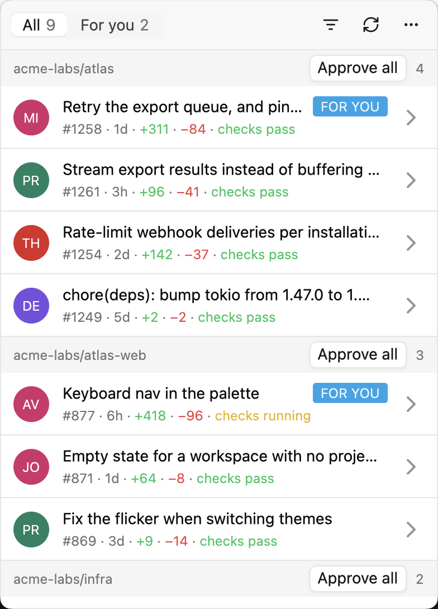
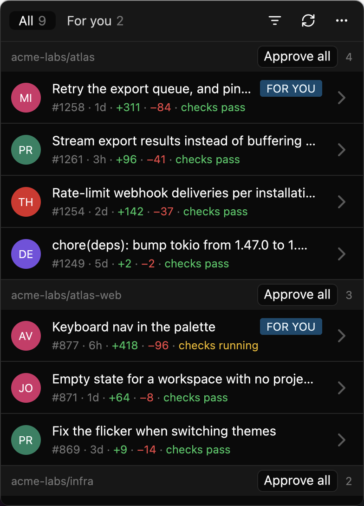
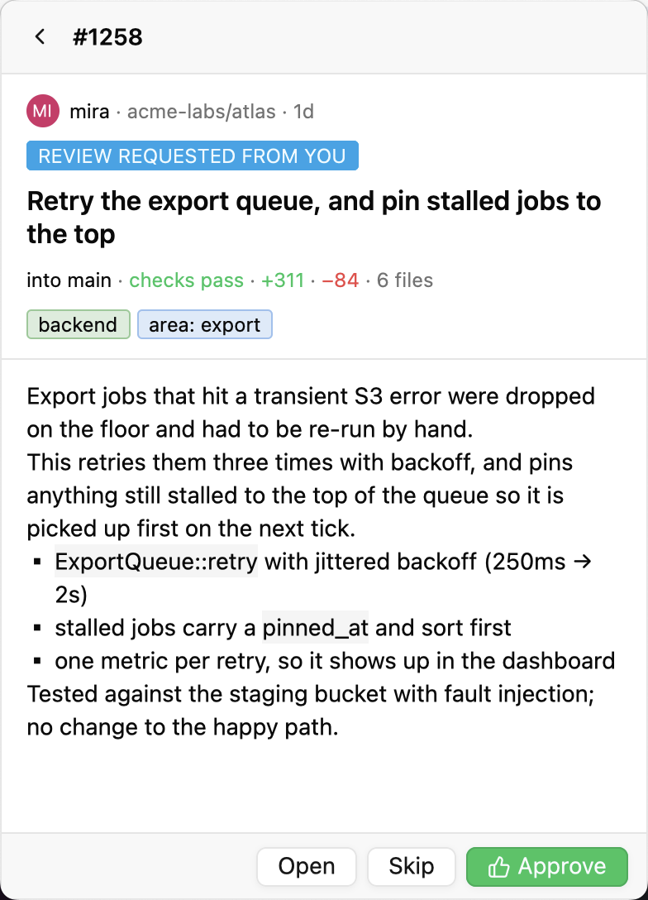
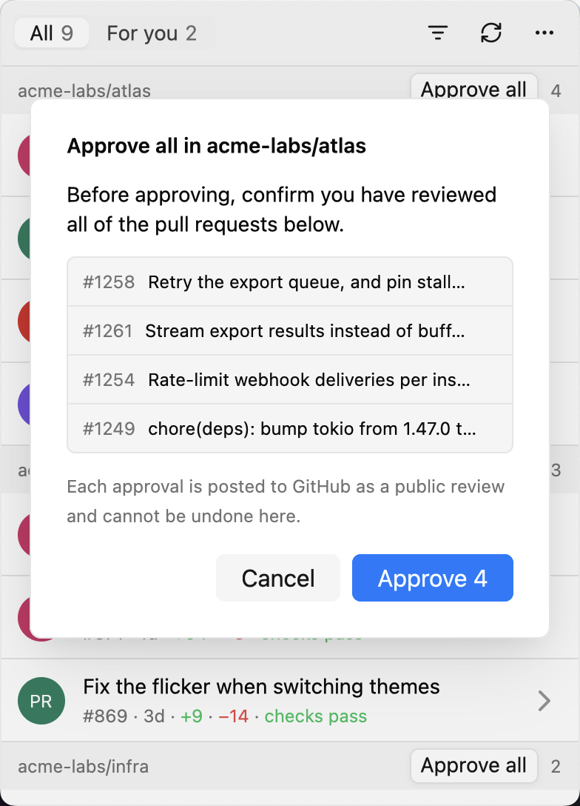
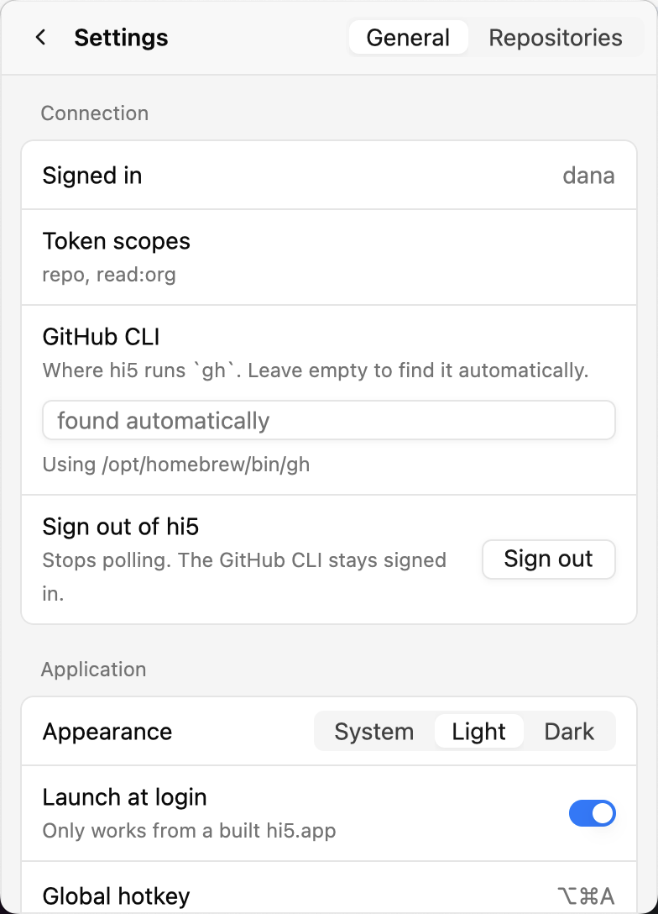

# hi5 🖐

A macOS menu-bar app for approving pull requests with zero friction.

The name is the point: hi5 is about whoever is free lending a hand, not about
your personal review queue. The inbox is every open PR with **zero reviews
yet**, across the GitHub orgs you watch — the shared pile anyone could step in
on. PRs where a review was specifically requested **from you** are sorted to
the top of their repo group and marked "for you", but they're a highlighted
subset, not the whole list. hi5 shows you the PR body and approves with one
click. It never opens a browser and never shows you a diff — anything you
can't decide from the description belongs on github.com.

  
  &nbsp;&nbsp;
  

## Requirements

- macOS 13+
- [GitHub CLI](https://cli.github.com) (`brew install gh`), signed in
  (`gh auth login`)
- Rust 1.97+ to build. **No Xcode needed** — see *Building* below.

## Install

Download [`hi5-macos-universal.dmg`](https://github.com/jondot/hi5/releases/latest/download/hi5-macos-universal.dmg)
from the [latest release](https://github.com/jondot/hi5/releases/latest), open
it, and drag **hi5** onto **Applications**. (There is a `.zip` of the same
bundle beside it.)

The app is not notarized — there is no Apple Developer certificate behind
this project — so the first launch needs one extra step: right-click `hi5.app`
→ **Open** → **Open**, or

    xattr -dr com.apple.quarantine /Applications/hi5.app

After that it opens like any other app. Every release is one universal binary
(Apple silicon and Intel, macOS 13+), built by
[`.github/workflows/release.yml`](.github/workflows/release.yml) from a `v*`
tag and signed with cosign; the release notes say how to verify a download.

## Signing in

hi5 reads your credential from `gh auth token` and holds it **in memory only** —
it is never written to disk. It finds `gh` wherever it is: on your `PATH`, in
Homebrew's, MacPorts' or nix's directories, or wherever your login shell says —
an app opened from `/Applications` does not inherit your shell's `PATH`, and
hi5 does not rely on it. If it still can't find yours, Settings ▸ Connection ▸
**GitHub CLI** takes a path, and Settings is reachable from the connect screen.

The baseline scope is **`repo`**. hi5 also reads `read:org` to discover which
orgs to offer as watch targets; a `gh` login grants this by default.

## Usage

Click the 🖐 in the menu bar, or press the configured hotkey (⌥⌘A by default).
Click a PR to read it, then **Approve** (⌘↵) or **Skip**.

The list is every open PR with zero reviews yet, across the orgs Settings →
Watched organizations has checked (auto-populated the first time it's empty).
PRs asked of you specifically carry a small "for you" marker and sort to the
top of their repo's group.

<table>
  <tr>
    <td align="center"></td>
    <td align="center"></td>
    <td align="center"></td>
  </tr>
  <tr>
    <td align="center">Read it, then Approve or Skip</td>
    <td align="center">Approve all, after you confirm</td>
    <td align="center">Settings</td>
  </tr>
</table>

**Approve has no undo.** It posts a real, publicly visible approval review
immediately — there is no confirmation dialog and no way to retract it from hi5.

**Skip** mutes a PR until its head commit changes, so it returns to your inbox
the next time the author pushes something new.

**Approve all**, on each repository's header, approves every PR shown under it
— after a confirmation that lists them by number and title, so you can check
you have actually read each one. Approvals go out one at a time; a PR that
cannot be approved (merged or closed since the last poll) stays in the list and
the status bar says how many went through.

**Muting a repo is reversible.** Settings → Repo filter lists every repo hi5 has
seen in your inbox *plus* every repo you have muted, so a muted repo stays on the
list (just unchecked) and can be un-muted by checking it again. This is
separate from org watching above: muting drops a repo's PRs from results
you'd otherwise see; watching decides which orgs get queried at all.

**Sign out is hi5's own.** Settings ▸ General ▸ Connection ▸ Sign out stops
polling and stops hi5 using any credential until you press Sign in on the screen
that follows. It does not sign `gh` itself out — that is your terminal's session,
not hi5's; use `gh auth logout` for that.

## Configuration

Settings live in `~/Library/Application Support/com.hi5.app/`. Tokens are never
written there.

## Building

    cargo build --release -p hi5-gpui
    ./scripts/bundle.sh release        # -> target/release/hi5.app
    ./scripts/dmg.sh target/release/hi5.app target/release/hi5.dmg   # optional

`cargo run -p hi5-gpui` is enough for development; notifications and
launch-at-login need the bundle. The app icon is drawn by `scripts/icon.py`
into `assets/hi5.icns`. No Xcode required — gpui's `runtime_shaders` feature
compiles the Metal shaders at runtime, so the Command Line Tools are enough.

## Testing

    cargo test --workspace
    cargo clippy --workspace --all-targets -- -D warnings
    cargo fmt --all --check

The UI is tested headlessly — the real screens laid out by gpui with no
window, driven by synthetic clicks and keys, against a backend that records
commands instead of performing them (`crates/hi5-gpui/src/testing.rs`). To
*look* at every screen with real fonts:

    cargo run --release --bin preview -- target/preview

The screenshots in this README come from the same binary, on invented data
(`fixtures::showcase`), shot on the sharpest attached display:

    cargo run --release --bin preview -- --readme docs/screenshots

## License

MIT — see [`LICENSE`](LICENSE).
